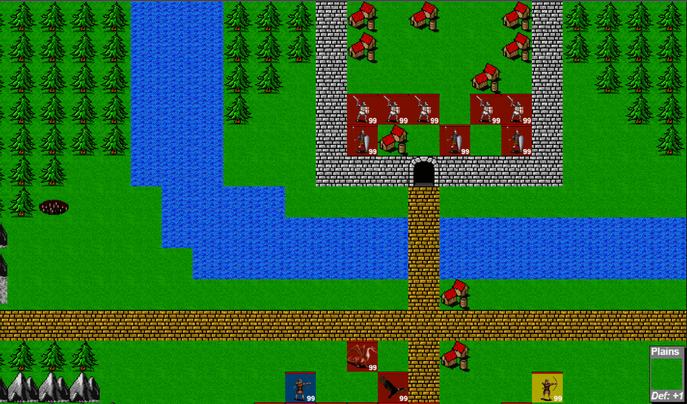

# His Dark Majesty-HTML

**This project is a copy of an old one and is not further maintained.**

His Dark Majesty is a story-driven turn-based strategy game that takes the core elements of Advance Wars and The Battle for Wesnoth. The game is free to download and works on a 8-bit Atari computer which has 64KB of memory and 1.77 MHz CPU!

## The story

"The world hath never been a safe and silent place, however its perils were familiar and well known. The Dark Army that descended upon the land one disastrous decade ago brought with it chaos and pain, and made of these simple worries only a memory. An eternity of dread and affliction became a certainty for the high-born and peasant alike. The virtuous king of the land hath been executed and his son left to rot in a prison cell. Memories of his life as the Prince of the land have faded away like mist, and only half-remembered visions, clutched tightly to his breast, of the sun upon an open field, or the smile on a maiden's face armor his soul from complete madness. It seemed that all hope had been relinquished..."

## The features

- Single player campaign with interesting story in 23 chapters.
- Challenging and fast artifical intelligence.
- 26 different units with unique features and abilities, including flying units, water units, mages and beasts.
- 10 characters that help you or challenge you during the game.
- Graphics, music and sound effects by the best 8bit artists.
- Intro and outro scenes.
- Intuitive user interface.
- In-game hint system that teaches you how to play.

## The port

This project is a port of the original game from 8bit Atari to HTML. The goal is to make the game playable on modern browsers and devices. The port is still in progress and may have some bugs or differences from the original game. REMARK: it does not work in the modern browser because of outdated EaseJS library.
